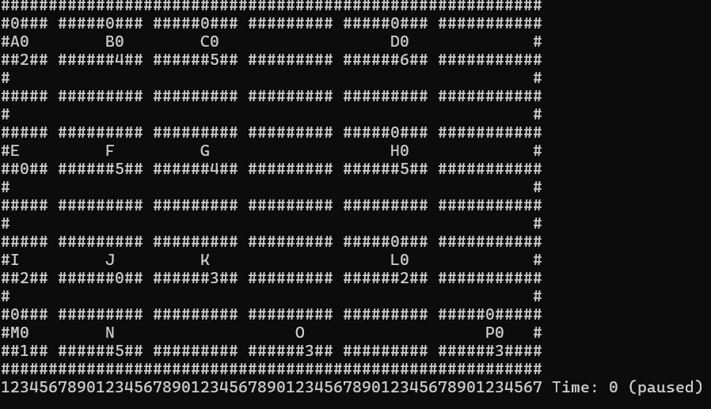
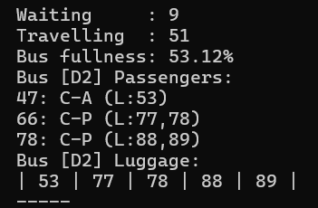

# BIG CITY – Real-Time Public Transport Simulation

A console-based simulation of a city's public transport network, written entirely in **C**. Six bus lines, twelve buses, and sixteen stops (A–P) run on a fixed grid map, with randomly generated passengers boarding and alighting under FIFO queueing rules while carrying up to two pieces of luggage each.


<p align="center">
  
</p>

## Overview

The simulation models a smart public transportation system operating on a 21×57 text grid. Buses follow fixed routes and reverse direction at the end of their line, exchanging passengers with each stop they visit. Every passenger has a randomly assigned origin and destination stop and 0–2 pieces of luggage; boarding follows FIFO order and is only allowed if the bus has enough room for both the passenger and their luggage.

The system is split into three layers:

1. **Data layer** – structs defining passengers, buses, stops, bus lines, and the city map.
2. **Simulation engine** – moves buses, loads/unloads passengers, enforces luggage capacity, and advances simulated time.
3. **Visualization & analytics layer** – renders the city grid and prints live statistics (waiting/travelling passenger counts, bus occupancy, per-bus passenger and luggage lists) to the terminal.

<p align="center">
  
</p>

## Features

- Real-time simulation loop with run / pause / step-by-step control
- Dynamic, per-stop passenger queues with FIFO boarding
- Luggage tracking with unique IDs, capacity-checked against each bus
- Interactive terminal UI: live city map, selected-stop detail view, and a focused view of one bus's passengers and luggage
- Modular architecture cleanly separating data, simulation logic, and rendering

**Controls**

| Key | Action |
|---|---|
| `R` | Run the simulation continuously |
| `SPACE` | Advance one step at a time |
| `W` / `E` | Select previous / next stop |
| `S` | Select a bus by ID (e.g. `A1`, `D2`) to inspect |
| `Q` | Quit |

## Data structures

- `Passenger` – id, start/end stop, luggage count and IDs
- `PassengerQueue` – a preview queue of newly generated passengers
- `BusStop` – a FIFO queue of passengers waiting at a stop
- `Bus` – line, ID, current stop, direction, onboard passengers and luggage
- `BusLine` – the ordered sequence of stops a line serves
- `CityMap` – the 21×57 character grid used for rendering

## Build & run

The project targets Windows (it uses `<windows.h>` for `Sleep()` and clears the console with `system("cls")`).

```bash
gcc src/big_city.c -o big_city.exe
big_city.exe
```

On Linux/macOS, replace the `Sleep()` call and the `CLEAR` macro's Windows branch with a POSIX equivalent (`usleep()` and `system("clear")`, which the code already falls back to when `_WIN32` is not defined) and drop the `<windows.h>` include.

## Challenges & solutions

- **Queue corruption** – fixed with explicit bounds checks on each stop's `front`/`rear` indices.
- **Screen flicker** – reduced with a controlled refresh rate between simulation steps.
- **Luggage deadlocks / overload** – a bus only boards a passenger if their luggage fits within its remaining capacity.
- **Passenger unloading errors** – solved by shifting the passenger array in place when removing an alighting passenger.

## Repository contents

```
├── README.md
├── LICENSE
├── src/
│   └── big_city.c                        # full simulation source
├── report/
│   ├── Big-City-Report.pdf               # final project report
│   └── Big-City-Report.docx
├── slides/
│   ├── Big-City-Presentation.pdf         # project presentation
│   └── Big-City-Presentation.pptx
└── images/
    ├── terminal-city-grid.png
    └── terminal-live-stats.png
```

The [full report](report/Big-City-Report.pdf) covers the system design, data structures, key algorithms, and challenges faced in detail; the [presentation](slides/Big-City-Presentation.pdf) is a condensed walkthrough of the same material.

## Team

- Ömer Ege Nişli (2024502054) – city grid initialization, core architecture
- Yiğithan Yıldırım (2024502076) – passenger queue logic, FIFO implementation
- Asal Ghazi Mir Saeid (2022502017) – UI rendering, statistics display

## Future work

- Colorful graphical interface (beyond the terminal)
- Multi-threading for smoother, larger-scale simulations
- Passenger impatience and timing logic

## License

Released under the [MIT License](LICENSE).
